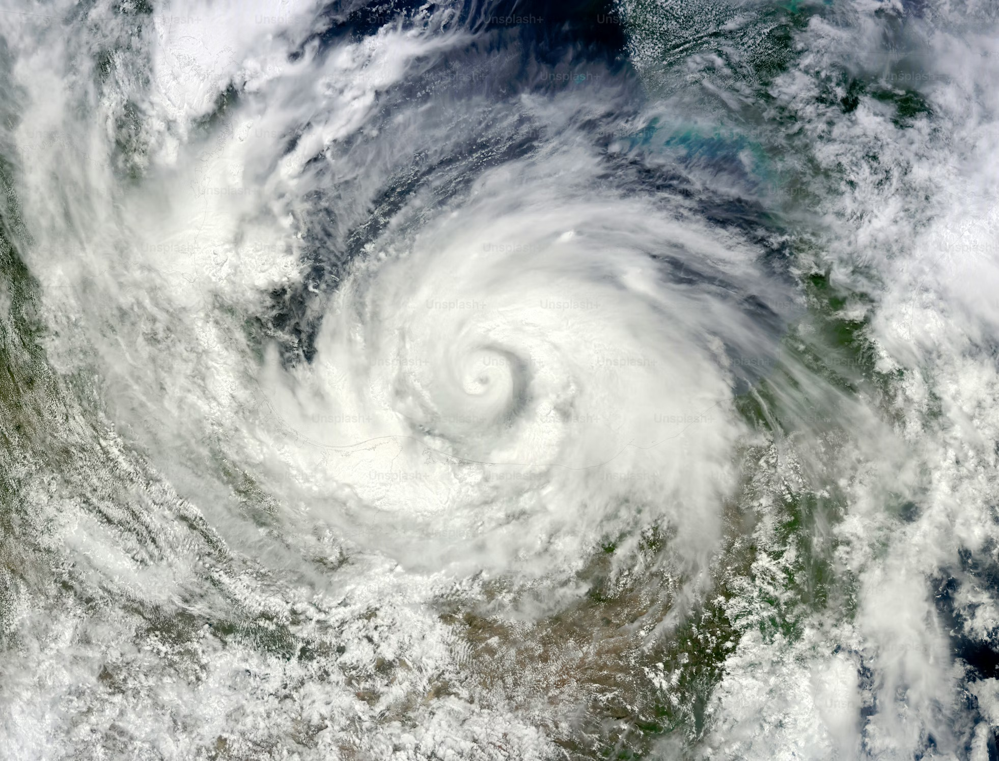
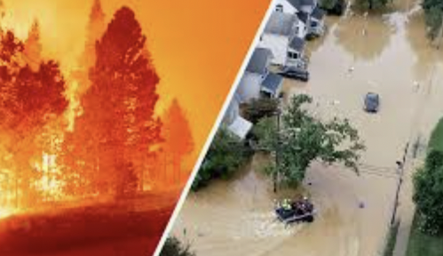
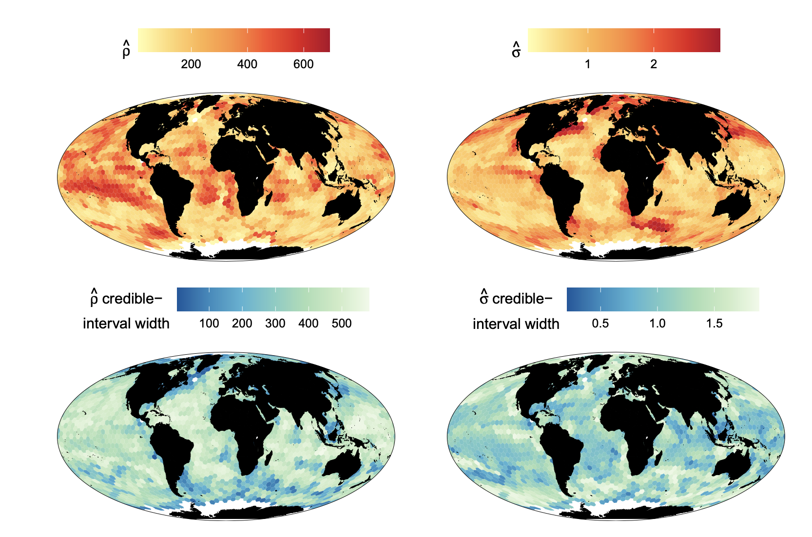

Our research focuses on spatio-temporal modelling and environmental applications. Below we list some of our current research projects.

 

:::{.research-project}
:::: {.columns .align-items-center}

::: {.column width="55%" .research-text}
**AI-enhanced spatio-temporal modelling and forecasting**

Complex environmental systems—such as weather patterns, ocean dynamics, and atmospheric phenomena—are inherently high-dimensional and nonlinear. We use deep learning to model these systems in ways that would be intractable with classical methods, enabling both more accurate representations of complex dynamics and dramatically faster computations. Crucially, our approaches are probabilistic: we produce full predictive distributions rather than point forecasts, rigorously quantifying uncertainty in our predictions. This uncertainty quantification is essential for risk assessment and decision-making under environmental uncertainty.

[→ Sea-surface temperature nowcasting](https://www.sciencedirect.com/science/article/abs/pii/S2211675320300026){.read-more-link}

[→ Fourier neural operators for precipitation nowcasting](https://arxiv.org/abs/2601.01813){.read-more-link}
:::

::: {.column width="40%" .research-image-col}
{}
:::

::::
:::

:::{.research-project}
:::: {.columns .align-items-center}

::: {.column width="55%" .research-text}
**Flexible modelling for climate extremes**

Risk assessment of natural hazards—such as heatwaves, floods, and wildfires—requires statistical analysis of extreme events, often beyond observed levels. We develop flexible models for multivariate and spatial extremes with rich tail dependence in both the upper and lower tails, enabling realistic characterisation of joint and compound risk when standard dependence assumptions fail. Alongside model development, we design efficient, scalable inference methods that deliver principled uncertainty quantification for extrapolation and decision support.

[→ Quantifying joint heatwave risk via flexible tail dependence](https://www.sciencedirect.com/science/article/pii/S2211675322000744){.read-more-link}

[→ Graph-based discovery of river discharge risk network](https://www.tandfonline.com/doi/full/10.1080/00401706.2024.2304334){.read-more-link}

[→ Joint spatial prediction of extreme wildfire frequency and spread](https://link.springer.com/article/10.1007/s10687-022-00460-8){.read-more-link}
:::

::: {.column width="40%" .research-image-col}
{}
:::

::::
:::

:::{.research-project}
:::: {.columns .align-items-center}

::: {.column width="55%" .research-text}
**Neural networks for accelerated inference**

Estimating parameters in a statistical model is often the computational bottleneck of a spatio-temporal data analysis. Further, often computations often need to be done several times (e.g., millions of times) daily. For this reason, we have been investigating deep learning methods for fast approximate inference in large-scale spatio-temporal models, to enable real-time environmental monitoring and forecasting in classically intractable settings.  These tools are lightning fast, do not require knowledge of the likelihood function, and can yield accurate inferences.

[→ Neural networks for Bayes estimation](https://www.tandfonline.com/doi/full/10.1080/00031305.2023.2249522){.read-more-link}

[→ Analysing irregular spatial data](https://www.tandfonline.com/doi/full/10.1080/10618600.2024.2433671){.read-more-link} 

<!-- [→ Fast estimation with censored data](https://jmlr.org/beta/papers/v25/23-1134.html){.read-more-link} -->

[→ Review paper](https://www.annualreviews.org/content/journals/10.1146/annurev-statistics-112723-034123){.read-more-link}  
:::

::: {.column width="40%" .research-image-col}
{}
:::

::::
:::

:::{.research-project}
:::: {.columns .align-items-center}

::: {.column width="55%" .research-text}
**Modern spectral analysis**

Spectral methods are a powerful class of analysis that allow for analysis in near-linear time and so can be scaled to massive data. Their rare combination of speed, interpretability, and statistical grounding is increasingly valuable in contemporary scientific inference. By analysing how variability is distributed across spatial and temporal scales, spectral methods can sidestep aspects of model specification that complicate likelihood-based inference, while offering substantial computational advantages. However, classical spectral techniques rely on restrictive data conditions such as regular sampling, stationarity, or long uninterrupted records, and are subject to well-known biases arising from these simplifying assumptions. Our work addresses this by (1) providing novel methods to mitigate bias and spectral leakage and (2) extending to methodologies that work on irregular data. 

[→ Debiased spectral estimation](https://academic.oup.com/biomet/article/111/4/1313/7703280){.read-more-link}

[→ Bias correcting spectral estimators](https://academic.oup.com/biomet/article/112/3/asaf033/8121249){.read-more-link}
:::

::: {.column width="40%" .research-image-col}
{}
:::

::::
:::

:::{.research-project}
:::: {.columns .align-items-center}

::: {.column width="55%" .research-text}
**Survival analysis for time-to-event data**

Many environmental processes are naturally described by the time until a critical event occurs, including mortality, habitat loss, ecological collapse, pathogen exposure, disease progression or system failure. Such data are inherently incomplete because events may be right-censored, interval-censored, or subject to left truncation, and observation windows often vary across individuals, sites or regions. We develop semi-parametric survival models for time-to-event data that explicitly account for censoring and truncation while retaining the flexibility of hazard-based regression without imposing restrictive parametric assumptions. Our work advances survival analysis by combining flexible hazard modelling, penalized likelihood estimation and time-varying or nonlinear effects, enabling interpretable and reliable risk assessment in complex environmental systems.

[→ Optimisation of accelerated failure time models](https://arxiv.org/abs/2403.12332){.read-more-link}
:::

::: {.column width="40%" .research-image-col}
{}
:::

::::
:::

:::{.research-project}
:::: {.columns .align-items-center}

::: {.column width="55%" .research-text}
**Statistical methodology for Antarctic science**

We collaborate with the program [Securing Antarctica's Environmental Future (SAEF)](https://arcsaef.com/) to develop statistical methods for Antarctic research, including techniques for predicting sea-level rise contribution, calibrating ice sheet models, and modelling biodiversity in polar ecosystems. This work requires fusion from multiple data sources—such as satellites, numerical models, and in-situ observations—as well as statistical downscaling and high-performance computing to enable inference at scale.

[→ AI approaches for ice sheet calibration](https://arxiv.org/abs/2512.09561){.read-more-link}

[→ Statistical downscaling for modelling polar ecosystems](https://besjournals.onlinelibrary.wiley.com/doi/full/10.1111/2041-210X.14505){.read-more-link}
:::

::: {.column width="40%" .research-image-col}
{}
:::

::::
:::